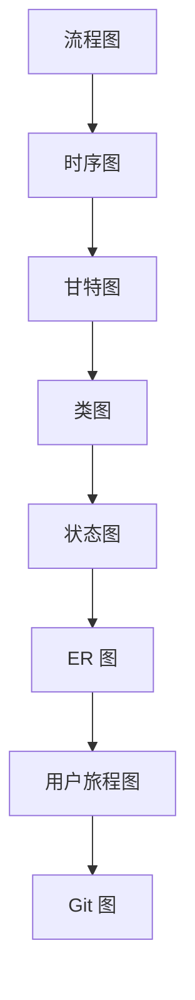
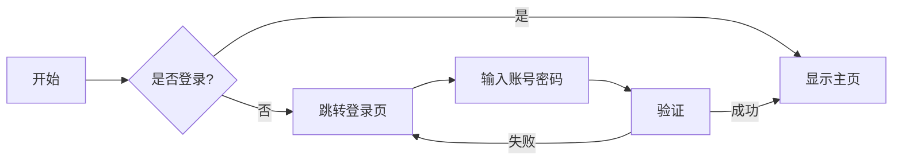
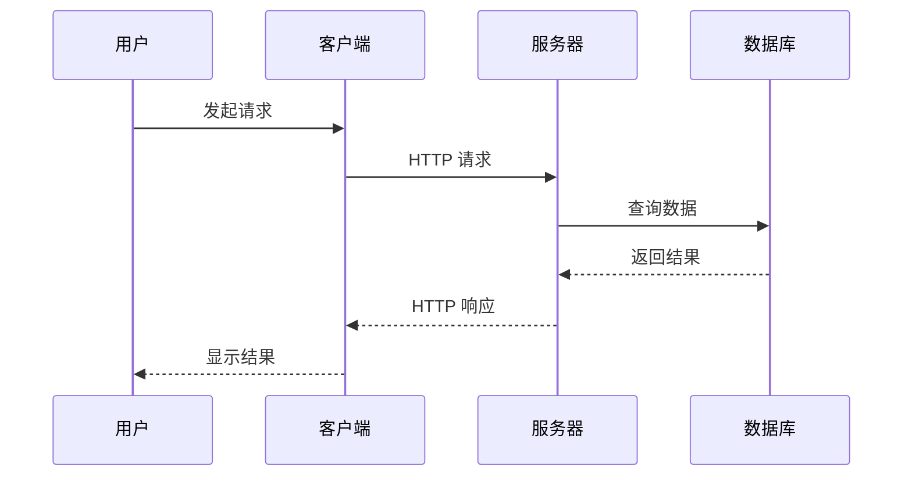
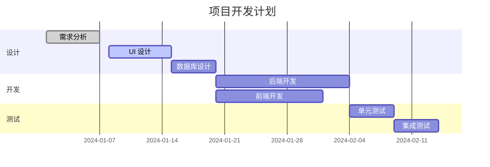

# Mermaid 块组件

## 功能特性

### 内置工具栏
我们使用 BlockNote 风格的内置工具栏，提供了更加一致的用户体验：

- **下拉菜单式工具栏**：点击右上角的 "Mermaid" 按钮展开操作菜单
- **悬停显示**：鼠标悬停在块上时显示工具栏按钮
- **操作选项**：
  - 📝 编辑代码 - 打开代码编辑器
  - 📋 复制代码 - 复制 Mermaid 源代码到剪贴板
  - 🗑️ 删除图表 - 删除当前 Mermaid 块

### 编辑器特性

- **全屏编辑对话框**：居中显示，带有半透明背景
- **语法高亮**：使用等宽字体显示代码
- **实时预览**：保存后立即渲染图表
- **错误处理**：语法错误时显示友好的错误提示
- **深色模式支持**：自动适配深色主题

### 支持的图表类型

## 使用方法

### 1. 插入 Mermaid 块

在编辑器中输入 `/` 触发 Slash 菜单，然后选择 "Mermaid Diagram" 或输入 `mermaid`、`diagram`、`chart` 等关键词。

### 2. 编辑图表

点击右上角的 "Mermaid" 按钮，然后选择 "编辑代码" 打开编辑器。

### 3. 示例代码

#### 流程图

#### 时序图

#### 甘特图

## 技术实现

### 架构设计

1. **组件分离**：将渲染逻辑从块定义中分离，提高可维护性
2. **状态管理**：使用 React Hooks 管理编辑状态和渲染状态
3. **防抖渲染**：避免频繁渲染，提高性能
4. **错误边界**：优雅处理渲染错误，避免崩溃

### 样式系统

- 使用 Tailwind CSS 实现响应式设计
- 支持深色模式自动切换
- 自定义 Mermaid 主题配色

### 交互优化

- 键盘快捷键支持（ESC 关闭编辑器）
- 点击外部区域关闭下拉菜单
- 动画过渡效果提升体验

## 注意事项

1. **性能考虑**：大型图表可能影响渲染性能，建议适度控制图表复杂度
2. **浏览器兼容性**：需要现代浏览器支持 SVG 渲染
3. **导出限制**：导出的 SVG 文件可能需要额外的样式处理才能在其他应用中正确显示

## 后续优化

- [ ] 添加图表模板库
- [ ] 支持实时协同编辑
- [ ] 添加更多导出格式（PNG、PDF）
- [ ] 集成 AI 辅助生成图表
- [ ] 支持自定义主题配色
