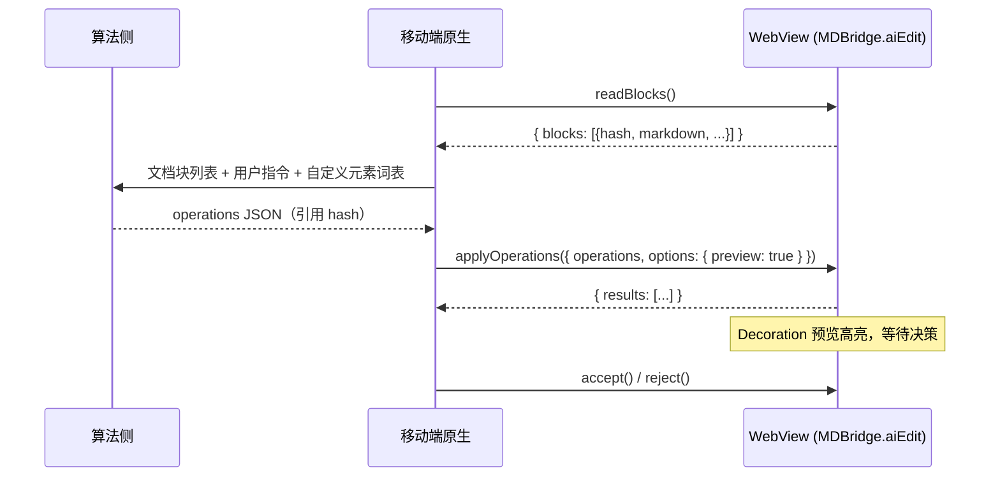
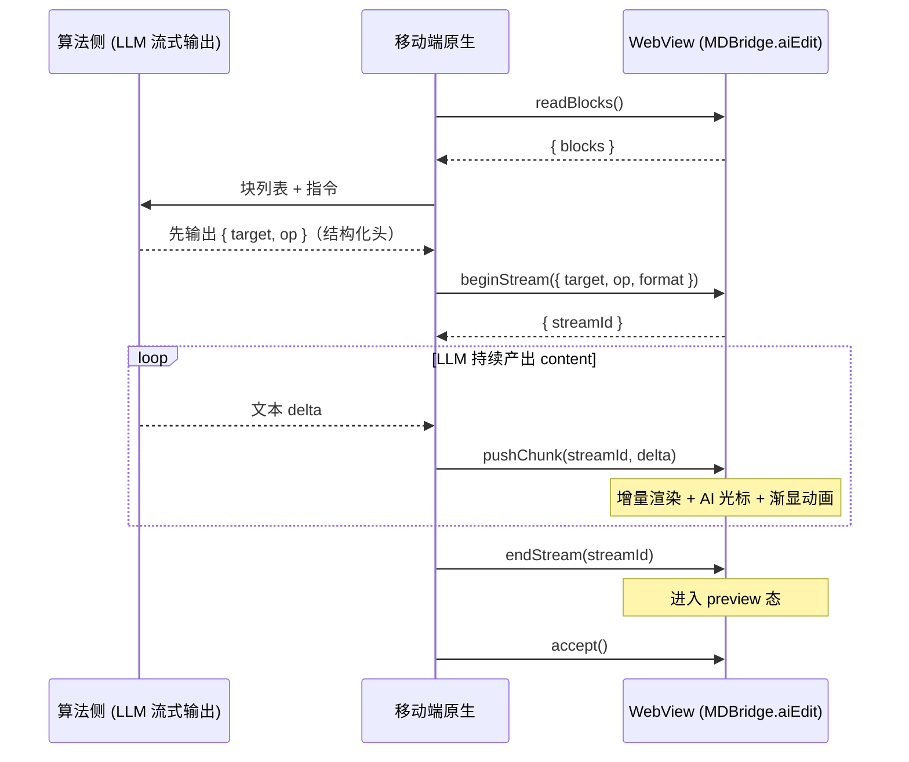
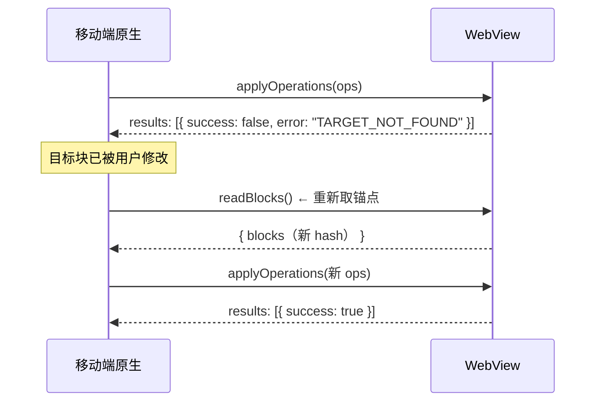

# AI 区域编辑协议（Hash 锚点）设计文档

> 本文档定义 **移动端 / 算法侧** 通过 WebView 对 Tiptap 文档进行 **区域级插入 / 修改** 的数据交互协议
> 核心思路：web 端为每个顶层块生成 **内容 hash** 作为锚点，外部用 `{ target: hash, op, content }` 的 JSON 操作描述编辑意图，web 端负责寻址、流式渲染与预览
>
> 参考先例：Tiptap 官方 Server AI Toolkit 的 `tiptapEdit`（*"Targets are node hashes from tiptapRead"*）、
> aider / Diff-XYZ 的编辑格式实证研究（内容锚点 ≫ 行号 / 坐标锚点）

---

## 1. 为什么是 hash，而不是位置 / 行号 / 整篇 Markdown

| 方案 | 问题 |
|------|------|
| ProseMirror 坐标 `{from, to}` | 编辑器内部值，外部拿不到也算不出；文档一变即失效 |
| 行号 | LLM 实证最不擅长输出精确数字偏移（aider benchmark、Diff-XYZ） |
| 整篇 Markdown 重写 | 大文档贵且慢；Markdown 有损，会丢掉 *GradientHighlight* 等非 Markdown 样式 |
| 纯 search/replace | 长文档重复段落产生歧义；无法表达「在某块后新增」的结构性插入 |
| **块 hash 锚点** | 外部只需透传 web 端发的不透明字符串；天然具备「内容变了 → 锚点失效」的冲突检测语义 |

hash 是 **不透明令牌（opaque token）**：由 web 端生成、由 web 端解析，移动端与算法侧 **永远不需要自己计算 hash**，只负责「读到什么就引用什么」

---

## 2. Hash 设计

### 2.1 粒度：顶层块（top-level block）

**对 `doc` 的每个直接子节点生成一个 hash**，即 ProseMirror 文档的第一层节点：

```
doc
├── heading        → hash ①
├── paragraph      → hash ②
├── bulletList     → hash ③   ← 整个列表是一个锚点，内部 listItem 不单独编址
├── codeBlock      → hash ④
└── table          → hash ⑤   ← 整个表格是一个锚点
```

**为什么停在这一层：**

1. **与 LLM 的思维粒度对齐** —— 算法侧看到的是「一段 Markdown 对应一个 hash」，正好是段落 / 标题 / 列表这种人类与模型都习惯的编辑单位
2. **嵌套编址的复杂度不值得** —— 若给 listItem、tableCell 也发 hash，协议要引入路径寻址（`hash/0/2`），且子节点变动会连带父 hash 失效，冲突语义变得难解释
3. **块内细粒度修改有更好的工具** —— 用 `searchReplace` 操作（见 §3.2），在目标块内做精确字符串替换，这正是 Claude Code 的 string-replace 思路，两种方案在此互补而非互斥

> ⚠️ 超长块（如 500 行的列表）整体替换成本高，应引导算法侧用 `searchReplace`；
> 协议层不为此增加嵌套编址，这是有意取舍

### 2.2 Hash 输入：对什么内容做 hash

```
hash = fnv1a64( nodeType + '\x00' + JSON.stringify(node.toJSON()) ).toString(16)
```

**对节点的 ProseMirror JSON 序列化结果做 hash，而不是对 Markdown 或纯文本。** 三种候选的对比：

| Hash 输入 | 问题 |
|-----------|------|
| `node.textContent`（纯文本） | 丢失 marks / attrs —— 两个文字相同但格式不同的块会撞 hash；只改格式不改文字时检测不到变更 |
| Markdown 序列化 | **有损**。两个块仅 gradient 高亮不同时，Markdown 完全一致 → 撞 hash → 可能改错块 |
| **ProseMirror JSON**（采用） | 无损、确定性，任何变更（含仅样式变更）都会改变 hash —— 这正是「锚点失效检测」需要的灵敏度 |

关键认知：**hash 的输入不需要和返回给调用方的内容（Markdown）一致**。因为 hash 是不透明令牌，调用方不验算。我们选择对「编辑器里真实存在的东西」做 hash，对「调用方可读的东西」返回 Markdown，两者解耦

> 确定性说明：读取与应用使用同一运行时、同一序列化代码路径，`node.toJSON()` 的键序在 V8 下由插入顺序决定且稳定，无需额外的 canonical JSON 处理

### 2.3 重复块消歧

两个内容完全相同的块（如多个空段落）base hash 相同。`readBlocks` 按文档顺序为重复项追加序号后缀：

```
9f3a1c2e        ← 第 1 次出现
9f3a1c2e#2      ← 第 2 次出现
9f3a1c2e#3      ← 第 3 次出现
```

应用时按「第 n 个匹配块」解析。后缀属于 target 字符串的一部分，调用方原样透传即可

### 2.4 生命周期：快照锚点，不持久化

- hash **不写入文档**，不参与 Markdown / JSON 序列化，对协同编辑零侵入
- 有效窗口 = `readBlocks` 到 `applyOperations` 之间。这是一个 **乐观锁**：
  - 期间用户（或前一个操作）改动了某块 → 该块 hash 失效 → 对应操作单独失败（`TARGET_NOT_FOUND`），**其余操作照常执行**
  - 调用方收到失败后重新 `readBlocks` 获取新锚点重试
- 操作序列内部：操作按数组顺序依次执行；`insertBefore` / `insertAfter` 不改变目标块本身，后续操作引用其它块的 hash 仍然有效；只有 `replace` / `delete` 会使 **目标块自身** 的 hash 失效

### 2.5 Hash 算法

默认 **FNV-1a 64-bit**（同步、零依赖、16 位 hex 输出）。文档级块数量（< 10⁴）下碰撞概率可忽略；且即便碰撞，后果只是落入 §2.3 的消歧路径，不会错改。算法可替换，调用方不应对 hash 的长度与格式做任何假设

---

## 3. 数据交互协议

所有 API 挂载在 `window.MDBridge.aiEdit` 命名空间下（原生 → web 直接调用）；web → 原生的回调走既有 `notify` 通道（`webkit.messageHandlers` / `Android.postMessage`）

### 3.1 读取：`readBlocks`

```ts
MDBridge.aiEdit.readBlocks(options?: ReadBlocksOptions): ReadBlocksResult
```

```jsonc
// 返回
{
  "docVersion": 42,                  // 文档事务计数，仅用于调试与日志关联
  "blocks": [
    { "hash": "b3c9d2e1a4f08812", "type": "heading",   "markdown": "# 会议纪要" },
    { "hash": "7a21e8c3d5b90f44", "type": "paragraph", "markdown": "[speaker:0] 我们先过一下上周的进展……" },
    { "hash": "9f3a1c2e88d0b7a6", "type": "paragraph", "markdown": "这段文字带高亮样式",
      "lossy": true,                 // ⚠️ 该块含 Markdown 无法表达的样式（如 gradient）
      "html": "<p><span data-color=\"skyBlue\">这段文字带高亮样式</span></p>" }
  ]
}
```

- `markdown` 始终返回，是算法侧的主要阅读格式（*Speaker* 以 `[speaker:N]` 占位符呈现）
- 当块包含 Markdown 表达不了的样式时，标记 `lossy: true` 并附带 `html` 字段——算法侧若要「保留原样式地改写」，应基于 `html` 生成 `format: 'html'` 的内容（见 §4）
- `options.range` 可选，只读取选区附近的块（配合既有选区交互）

### 3.2 应用：`applyOperations`

```ts
MDBridge.aiEdit.applyOperations(payload: ApplyPayload): ApplyResult
```

```jsonc
// 请求
{
  "operations": [
    // ① 整块替换
    { "target": "7a21e8c3d5b90f44", "op": "replace",
      "content": { "format": "markdown", "value": "改写后的整段内容" } },

    // ② 在某块后插入新块（结构性新增）
    { "target": "7a21e8c3d5b90f44", "op": "insertAfter",
      "content": { "format": "html",
                   "value": "<p><span data-color=\"skyBlue\">带高亮的新段落</span></p>" } },

    // ③ 块内细粒度替换（Claude Code 式 string-replace，限定在目标块内匹配）
    { "target": "b3c9d2e1a4f08812", "op": "searchReplace",
      "search": "会议纪要", "replace": "周会纪要" },

    // ④ 删除整块
    { "target": "9f3a1c2e88d0b7a6", "op": "delete" },

    // ⑤ 文档级操作：target 用保留字 "doc"
    { "target": "doc", "op": "append",
      "content": { "format": "markdown", "value": "## 待办事项" } }
  ],
  "options": {
    "preview": true                  // true：进入预览态（Decoration 高亮 + accept/reject）
  }                                  // false：直接落盘写入文档
}
```

```jsonc
// 返回（逐操作结果，部分成功是常态而非异常）
{
  "results": [
    { "target": "7a21e8c3d5b90f44", "success": true },
    { "target": "7a21e8c3d5b90f44", "success": true },
    { "target": "b3c9d2e1a4f08812", "success": false, "error": "SEARCH_NOT_FOUND" },
    { "target": "9f3a1c2e88d0b7a6", "success": true },
    { "target": "doc",              "success": true }
  ]
}
```

**操作类型一览：**

| op | target | 必填字段 | 语义 |
|----|--------|----------|------|
| `replace` | 块 hash | `content` | 整块替换（content 可为多个块） |
| `insertBefore` | 块 hash | `content` | 在目标块前插入 |
| `insertAfter` | 块 hash | `content` | 在目标块后插入 |
| `delete` | 块 hash | — | 删除整块 |
| `searchReplace` | 块 hash | `search` `replace` | 块内唯一字符串替换，块内多处匹配报 `SEARCH_NOT_UNIQUE` |
| `append` / `prepend` | `"doc"` | `content` | 文档末尾 / 开头插入 |
| `replaceAll` | `"doc"` | `content` | 整篇重写（兜底，慎用） |

### 3.3 流式：`beginStream` / `pushChunk` / `endStream`

打字机效果用于 **单个操作的 content 渐进渲染**（最常见场景：改写 / 新增一个区域，内容由 LLM 流式产出）：

```ts
// ① 开始：声明目标与操作类型，web 端立刻进入预览态并显示 AI 光标
const { streamId } = MDBridge.aiEdit.beginStream({
  target: '7a21e8c3d5b90f44',
  op: 'replace',                     // 仅支持 replace / insertBefore / insertAfter / append / prepend
  format: 'markdown',
})

// ② 原生侧每收到一个 LLM chunk 就转发（web 端内部节流合批渲染）
MDBridge.aiEdit.pushChunk(streamId, '改写后')
MDBridge.aiEdit.pushChunk(streamId, ' 的整段')
MDBridge.aiEdit.pushChunk(streamId, '内容……')

// ③ 结束：进入待决策态（preview），等待 accept / reject
MDBridge.aiEdit.endStream(streamId)

// ④ 决策
MDBridge.aiEdit.accept()             // 落盘，写入 undo 历史
MDBridge.aiEdit.reject()             // 还原原内容
```

- chunk 的累积、Markdown 增量解析、Decoration 预览高亮复用既有 `tiptap-ai` 管线（`AIOrchestrator` 的 `delta` 合并 + `TiptapEditorBridge.renderPreview`）
- **性能约定**：原生 `evaluateJavascript` 单次调用有开销，建议原生侧 ≥ 32ms 合批一次；web 端内部仍会再做一层 rAF 节流，双保险
- 流式期间用户手动编辑了目标区域 → web 端触发 `STREAM_CONFLICT`，终止流并通过事件回调通知原生（复用既有 `onConflict` 机制）

### 3.4 web → 原生事件

```ts
// 走既有 notify 通道，事件名常量化
'aiEdit:stateChange'   // { state: 'idle' | 'streaming' | 'preview' | 'accepted' | 'rejected' | 'error' }
'aiEdit:conflict'      // { streamId, target }          流式中用户编辑冲突
'aiEdit:result'        // ApplyResult                    applyOperations 异步完成时
```

### 3.5 错误码

| 错误码 | 含义 | 调用方策略 |
|--------|------|------------|
| `TARGET_NOT_FOUND` | hash 在当前文档中不存在（块已被改 / 删） | 重新 `readBlocks` 取新锚点重试 |
| `SEARCH_NOT_FOUND` | `searchReplace` 的 search 串在块内无匹配 | 检查 search 串或改用 `replace` 整块替换 |
| `SEARCH_NOT_UNIQUE` | search 串在块内多处匹配 | 扩大 search 串上下文使其唯一 |
| `INVALID_CONTENT` | content 解析失败（非法 HTML / Markdown） | 修正内容格式 |
| `STREAM_CONFLICT` | 流式期间用户编辑了目标区域 | 终止本次，重新 read + 重试 |
| `STREAM_NOT_FOUND` | streamId 不存在或已结束 | 编程错误，检查调用顺序 |

---

## 4. 内容格式：Markdown 与 HTML 双轨

`content.format` 二选一：

| format | 适用场景 | 自定义节点表达 |
|--------|----------|----------------|
| `markdown`（默认） | 常规文本、标题、列表、代码块 | *Speaker* 用 `[speaker:N]`（已有 tokenizer 支持） |
| `html` | 需要 Markdown 表达不了的样式时 | *GradientHighlight* 用 `<span data-color="skyBlue">`，其余自定义节点按各自 `parseHTML` 规则 |

**给算法侧的 Schema 说明（schema awareness）**：算法侧的 system prompt 中应附一份「本编辑器支持的自定义元素词表」，例如：

```
可用的自定义 HTML 元素（仅在 format: "html" 时使用）：
- 渐变高亮：<span data-color="GRADIENT">文字</span>
  GRADIENT ∈ mysticPurpleBlue | skyBlue | gorgeousPurpleRed | warmSunshine
           | naturalGreen | mysticNight | colorfulCandy | starryNight
           | metallic | snowyGlacier | tropicalSummer
- 说话人：<speaker>N</speaker>（N 为 readBlocks 返回的 originalLabel）
```

该词表应随自定义节点的增减同步维护（建议从 `tiptap-nodes` 的扩展定义中生成，避免手工漂移）

---

## 5. 完整时序

### 5.1 非流式（批量修改）



### 5.2 流式（单区域打字机渲染）



### 5.3 冲突重试



---

## 6. 渲染与动画

寻址层把 hash 解析为 ProseMirror `{from, to}` 后，渲染完全复用既有 `tiptap-ai` 管线：

| 能力 | 实现 | 状态 |
|------|------|------|
| 流式增量写入 | `TiptapEditorBridge.renderPreview`（delta 合并 + `insertContent`） | ✅ 已有 |
| 预览高亮 | ProseMirror Decoration（`AI_CLASSES.PREVIEW`） | ✅ 已有 |
| 接受 / 拒绝 / 撤销 | `applyPreview` / `clearPreview` + undo 历史 | ✅ 已有 |
| 冲突检测 | transaction mapping 范围重叠检测（`onConflict`） | ✅ 已有 |
| 打字渐显动画 | 在 Decoration class 上挂 CSS animation（fade-in / 背景扫光） | 🔧 新增（纯 CSS，~20 行） |
| AI 光标 | Widget Decoration 跟随流式插入点（参考官方 *AiCaret*） | 🔧 新增（可选，~60 行） |
| 自定义节点动画 | NodeView 内用 *motion/react* 做入场动画 | 🔧 按节点各自实现 |

---

## 7. 实现落点

| 模块 | 文件 | 职责 |
|------|------|------|
| 寻址层 | `tiptap-editor/packages/tiptap-api/src/operate/aiOperations.ts`（新增） | hash 生成、`readBlocks`、target → `{from, to}` 解析、操作分发 |
| 渲染层 | `tiptap-editor/packages/tiptap-ai/src/TiptapEditorBridge.ts`（小改） | `SelectionPayload` 支持外部注入 range（结构已预留） |
| 桥接层 | `packages/markdown-mobile-tiptap/src/hooks/useSetupMDBridge.ts`（新增 `aiEdit` 命名空间） | 暴露本协议全部 API + 事件回调 |
| 类型契约 | `tiptap-editor/packages/tiptap-api/src/operate/aiOperations.types.ts`（新增） | 本协议的 TS 类型，三方共享的唯一真实来源 |

---

## 8. 已知限制与取舍

1. **不支持块内嵌套编址**（listItem / tableCell 无独立 hash）——用 `searchReplace` 覆盖，复杂结构改动退化为整块 `replace`
2. **hash 是快照锚点**，长时间持有必然失效；协议假设「读 → 改」窗口在秒级到分钟级，不适合做持久书签（持久场景应另用 *UniqueID* 类方案，不在本协议范围）
3. **操作数组不具备事务性**：部分成功是设计行为（与 Tiptap 官方 `operationResults` 一致）；若业务需要全有或全无，调用方应在收到失败后整体 `reject`（preview 模式下天然支持）
4. **`format: 'markdown'` 中内嵌 HTML 的透传行为未验证**——实现阶段需在 playground 实测 `contentType: 'markdown'` 对 inline HTML 的处理，若不透传则严格双轨（整个 content 二选一），本协议已按严格双轨设计
