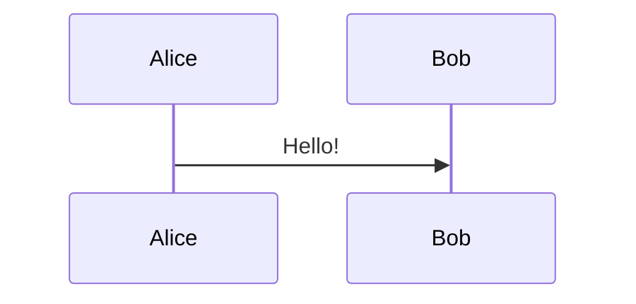

# tiptap-mermaid

Mermaid 图表节点：在编辑器中嵌入可编辑的 Mermaid 图表。

## 导出

| 导出 | 说明 |
|------|------|
| `MermaidNode` | Tiptap 节点扩展 |
| `MermaidNodeComponent` | React 渲染组件（编辑 + 预览） |
| `useMermaidEditor` | 代码编辑 hook |
| `useMermaidRenderer` | SVG 渲染 hook |
| `useMermaidTransform` | 代码转换 hook |

## 使用

通过 markdown 代码块语法插入：

````markdown

````

## 依赖

`tiptap-api` `tiptap-comps` `tiptap-utils` `beautiful-mermaid`
